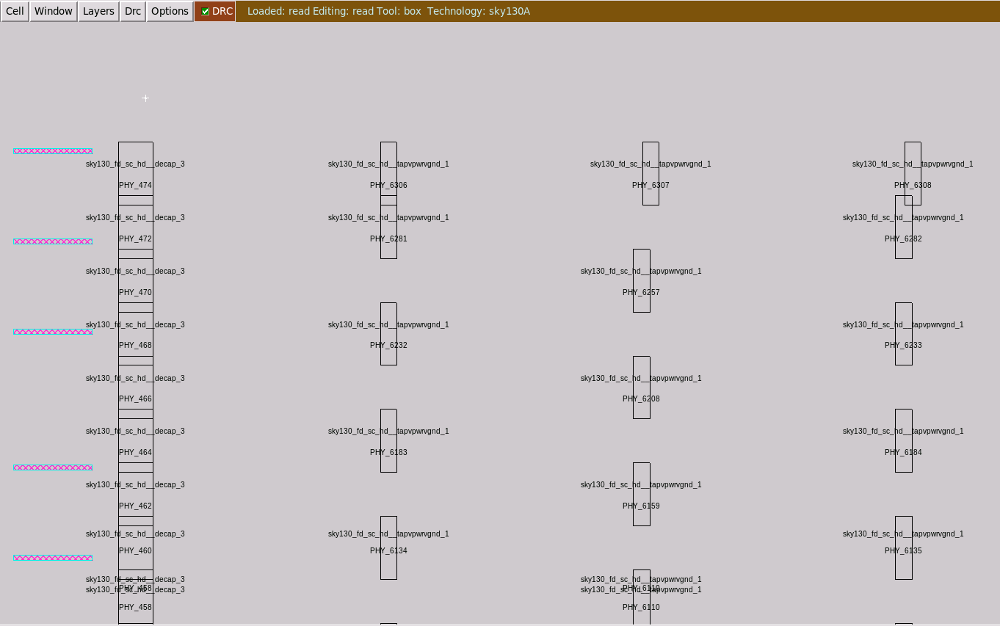
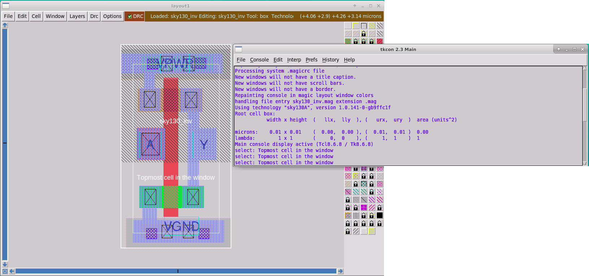
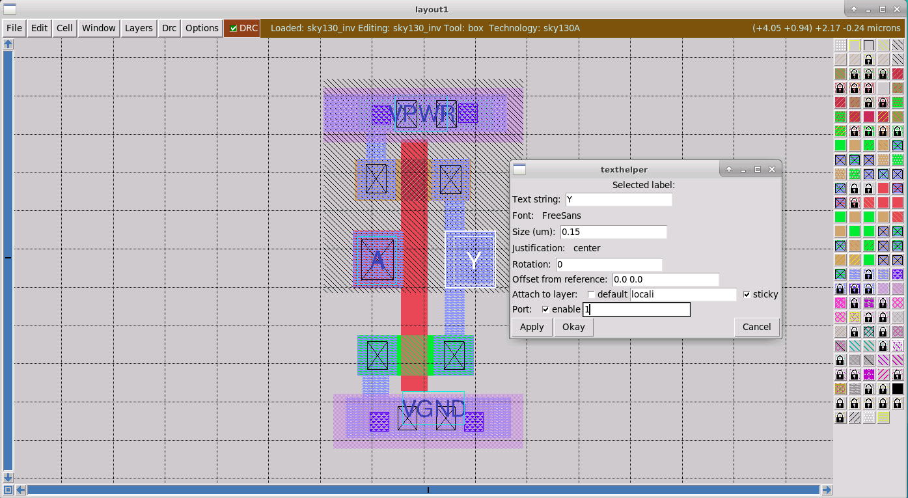

# Advanced Physical Design using Skywater130nm node 

  The idea of an OpenSource flow that includes tools for RTL to GDSII flow has always been a far fetched dream for FOSS enthusiast.  Physical Design using SKY130nm technology node using FOSS (Openlane Flow), this includes multiple flow tools that are all OpenSource. The tools can be listed as ```yosys``` and ```abc```, where abc is basically for sequential verification and synthesis. ```OpenSTA``` for static timing analysis, Fault that assists in inserting Design for Test implementation, ```OpenROAD App``` carries out mutiple steps such as floorplanning, placement, CTS-clock tree synthesis, Optimization in terms of better design placements. Other tools that are included in the specific flow are Antenna Diode insertion, Rotuing tool such as ```TritonRoute``` as few of the tools.


# Content
  - [Day 1](#day-1)
    - [OpenROAD flow](#openroad-flow)
    - [OpenSource Tools for RTL to GDSII Flow](#opensource-tools-for-rtl-to-gdsii-flow)
    - [Tools Usage](#tool-usage) 
  - [Day 2](#day-2)
    - [Floorplanning, power planning and pin placement](#floorplanning-power-planning-and-pin-placement)
    - [Synthesis and Floorplanning runs and new version of OpenLANE](#synthesis-and-floorplanning-runs-and-new-version-of-openlane)
    - [Placement command and magic tool to display](#placement-command-and-magic-tool-to-display)
  - [Day 3](#day-3)
    - [Custom layout design and simulation of a inverter insertion using tools](#custom-layout-design-and-simulation-of-a-inverter-insertion-using-tools)
    - [Extract the spice netlist](#extract-the-spice-netlist)
    - [Inverter Layout in different graphics using Magic](#inverter-layout-in-different-graphics-using-magic)
    - [Extracted Spice Deck](#extracted-spice-deck)
    - [Calcuations for rise, fall and delay time units](#calcuations-for-rise-fall-and-delay-time-units)

  - [Day 4](#day-4)
    - [Prepare MAG file](#prepare-mag-file)
    - [Generate LEF file](#generate-lef-file)
    - [Running the floorplan](#running-the-floorplan)
    - [Visualize the layout with magic](#visualize-the-layout-with-magic)
  
  - [Day 5](#day-5)
    - [TritonRoute and openSTA](tritonroute-and-opensta)
  
  - [References](#references)
# Day 1 
# OpenROAD flow

  Automating the process of RTL to GDSII is a the complete design flow from the designing of RTL using HDL languages such as ```verilog``` and ```VHDL``` or higher level abstration languages such as ```SystemC```, ```High-Level-Sysnthesis``` (HLS). There are newer abstraction for designing RTL such as ```BlueSpec Verilog```  and ```BlueSpec Haskell```.  The complete steps for in sequence can be listed using the openlane flow diagram as show below.
  
  

Listed in details are the tools that are included in the OpenLane flow that included the complete RTL to GDSII flow, the modules includes individual applications that carry out specific tasks on their own. All of which are OpenSource tools and are developed to work with the Skywater PDK and even to an extent with commercially available foundry PDKs:

  1. RTL Synthesis
      1. `yosys` - Synthesis task is to convert the language elements to a netlist RTL
      2. `abc` - abc can be seen as a Synthesis and verification tool of binary sequential logic circuits that mainly appear in synchronous hardware designs IPs. It combines the use of directed acyclic graph (DAG) based technology mapping for standard cells and also optimization based of And-Inverter graphs (AIGs).
  2. Timing analysis 
      1. `OpenSTA` - It is a tool to perform static timing analysis (STA) through which the timing reports can be generated, and this can highlight the timing violations (hold and setup violations).
  3. Floorplan and PDN (tools and )
      1. `init_fp` - Defines the core area for the macro as well as the rows (used for placement) and the tracks (used for routing)
      2. `ioplacer` - Places the macro input and output ports
      3. `pdn` - Generates the power distribution network
      4. `tapcell` - Inserts welltap and decap cells in the floorplan
  4. Placement
      1. `RePLace` - Performs global placement
      2. `Resizer` - Performs optional optimizations on the design
      3. `OpenPhySyn` - Performs timing optimizations on the design
      4. `OpenDP` - Perfroms detailed placement to legalize the globally placed components
  5. CTS
      1. `TritonCTS` - Synthesizes the clock distribution network (the clock tree)
  6. Routing *
      1. `FastRoute` - Performs global routing to generate a guide file for the detailed router
      2. `TritonRoute` - Performs detailed routing
      3. `SPEF-Extractor` - Performs SPEF extraction
  7. GDSII Generation
      1. `Magic` - Streams out the final GDSII layout file from the routed def
  8. Checks
      1. `Magic` - Performs design rule check (DRC) checks & Antenna Checks (antenna are due to 
      2. `Netgen` - Performs LVS Checks

# OpenSource Tools for RTL to GDSII Flow

OpenLANE integrated several key open source tools over the execution stages:
  - RTL Synthesis, Technology Mapping, and Formal Verification : [yosys + abc](https://github.com/YosysHQ/yosys)
  - Static Timing Analysis: [OpenSTA](https://github.com/The-OpenROAD-Project/OpenSTA)
  - Floor Planning: [init_fp](https://github.com/The-OpenROAD-Project/OpenROAD/tree/master/src/init_fp), [ioPlacer](https://github.com/The-OpenROAD-Project/OpenROAD/tree/openroad/src/ioPlacer), [pdn](https://github.com/The-OpenROAD-Project/OpenROAD/tree/openroad/src/pdngen) and [tapcell](https://github.com/The-OpenROAD-Project/OpenROAD/tree/openroad/src/tapcell)
  - Placement: [RePLace](https://github.com/The-OpenROAD-Project/OpenROAD/tree/openroad/src/replace) (Global), [Resizer](https://github.com/The-OpenROAD-Project/OpenROAD/tree/openroad/src/resizer) and [OpenPhySyn](https://github.com/scale-lab/OpenPhySyn) (Optimizations), and [OpenDP](https://github.com/The-OpenROAD-Project/OpenROAD/tree/openroad/src/opendp) (Detailed)
  - Clock Tree Synthesis: [TritonCTS](https://github.com/The-OpenROAD-Project/OpenROAD/tree/master/src/TritonCTS)
  - Fill Insertion: [OpenDP/filler_placement](https://github.com/The-OpenROAD-Project/OpenROAD/tree/openroad/src/opendp)
  - Routing: [FastRoute](https://github.com/The-OpenROAD-Project/OpenROAD/tree/openroad/src/FastRoute) (Global) and [TritonRoute](https://github.com/The-OpenROAD-Project/TritonRoute) (Detailed)
  - SPEF Extraction: [SPEF-Extractor](https://github.com/HanyMoussa/SPEF_EXTRACTOR)
  - GDSII Streaming out: [Magic](https://github.com/RTimothyEdwards/magic)
  - DRC Checks: [Magic](https://github.com/RTimothyEdwards/magic)
  - LVS check: [Netgen](https://github.com/RTimothyEdwards/netgen)
  - Antenna Checks: [Magic](https://github.com/RTimothyEdwards/magic)
  - Circuit Validity Checker: [CVC](https://github.com/d-m-bailey/cvc)

# Tool Usage

PDKs as stressed earlier are essential as they contain technology ```lef``` files that are used to harden macros for obtaining the GDSII file which is a binary file format representing planar geometric shapes, text labels, and other information about the layout in hierarchical form. The Skywawter 130 nm pdks contains there strutured files in three folders mainly ```Sky130A```, ```open_pdks``` and ```skywater pdks```.

   

Apart from the pdks the other essential folder that includes all of the tools that have been installed into a docker environment have been include in the openlane folder that contains the scripts to intialize the openlane flow. The ```flow.tcl``` contains scripts to intialize the tools, ```designs``` folder that contains the verilog IPs and configuration files for each of the project. The runs related information and reports with logs are contained in all of these project folders. At each of the runs the date is attributed as the run folder with the report all being automated with the help of the commands being automamted through openlane.

   
   
   
For invoking OpenLANE in Linux Ubuntu, we should first run the docker everytime we use OpenLANE. This is done by using the following script:
    
    $ docker (or)
    $ docker run -it -v $(pwd):/openLANE_flow -v $PDK_ROOT:$PDK_ROOT -e PDK_ROOT=$PDK_ROOT -u $(id -u $USER):$(id -g $USER) openlane:rc6
   
A custom shell script or commands can be generated to make the task simpler.
   
   - To invoke OpenLANE run the `./flow.tcl` script.
   - OpenLANE supports two modes of operation: interactive and autonomous.
   - To use interactive mode use `-interactive` flag with `./flow.tcl`

   
   
   
   
The figure ablve shows the content of the ```config.tcl``` file. It sets the path of the design files, timing files (SDC) files and the design name. Also the clock speed is assigned, with the ```clk``` port name.

   
   

One of the important evalations that gives a picture to the design that has been synthesized is the Flops to cell ratio between the number of flip flops generated and the total number of cells in the design. The design under consideration is the ```Picorv32a```, which is a RISC V archicture design.

$\text{Flops to Cell ratio} = \frac{\text{Number of FFs}}{\text{Number of Cells}}$
$\text{Flops to Cell ratio} = \frac{\text{1613}}{\text{14876}} = 0.1084 \text{(or)} 10.84\text{\%}$

# Day 2
# Floorplanning, power planning and pin placement

The layout is the necessary step to get a hardened macros and the GDSII file that needs to be sent to the foundry. This requires steps that are to be run is a particular order for getting the final file of masks that are stacked in a certain order with layers of metals, defining the area the devices that take place on the slicon wafer.

The tools are all inbuilt in the openlane flow and are to be run after synthesis ```run_synthesis```, the step that carries out the floorplanning is where the arrangement of logical block, library cells, pins are defined on wafer or chip. This step makes sure that the synthesized modeules has been assigned an appropriate area and aspect ratio. The pins are too assigned a definite interface that the users of the chip would like to interact with it as a complete sytem is created such as shown in the arduino board as an example. 


    run_floorplan

The details of the configuration variable are located in '/home/kisku.1/Desktop/work/tools/openlane_working_dir/openlane/configuration/README.md‌‌', these also has various ```switches``` for completing a user configured layout and floorplanning.  `FP_IO_HMETAL` and  `FP_IO_VMETAL` which defines the different metal layers assigned which are shown in the final runs as ```+1``` after the successful run. The complete floorplanning section is shown in the below.

    ### Floorplanning

    | Variable      | Description                                                   |
    |---------------|---------------------------------------------------------------|
    | `FP_CORE_UTIL`  | The core utilization percentage. <br> (Default: `50` percent)|
    | `FP_ASPECT_RATIO`  | The core's aspect ratio (height / width). <br> (Default: `1`)|
    | `FP_SIZING`  | Whether to use relative sizing by making use of `FP_CORE_UTIL` or absolute one using `DIE_AREA`. <br> (Default: `"relative"` - accepts "absolute" as well)|
    | `DIE_AREA`  | Specific die area to be used in floorplanning. Specified as a 4-corner rectangle. Units in mm <br> (Default: unset)|
    | `FP_IO_HMETAL`  | The metal layer on which to place the io pins horizontally (top and bottom of the die). <br>(Default: `4`)|
    | `FP_IO_VMETAL`  | The metal layer on which to place the io pins vertically (sides of the die) <br> (Default: `3`)|
    | `FP_IO_MODE`  | Decides the mode of the random IO placement option. 0=matching mode, 1=random equidistant mode <br> (Default: `1`)|
    | `FP_WELLTAP_CELL`  | The name of the welltap cell during welltap insertion. |
    | `FP_ENDCAP_CELL`  | The name of the endcap cell during endcap insertion. |
    | `FP_PDN_VOFFSET`  | The offset of the vertical power stripes on the metal layer 4 in the power distribution network <br> (Default: `16.32`) |
    | `FP_PDN_VPITCH`  | The pitch of the vertical power stripes on the metal layer 4 in the power distribution network <br> (Default: `153.6`) |
    | `FP_PDN_HOFFSET`  | The offset of the horizontal power stripes on the metal layer 5 in the power distribution network <br> (Default: `16.65`) |
    | `FP_PDN_HPITCH`  | The pitch of the horizontal power stripes on the metal layer 5 in the power distribution network <br> (Default: `153.18`) |
    | `FP_PDN_AUTO_ADJUST` | Decides whether or not the flow should attempt to re-adjust the power grid, in order for it to fit inside the core area of the design, if needed. <br> 1=enabled, 0 =disabled (Def
    ault: `1`) |
    | `FP_TAPCELL_DIST`  | The horizontal distance between two tapcell columns <br> (Default: `14`) |
    | `FP_IO_VEXTEND`  |  Extends the vertical io pins outside of the die by the specified units<br> (Default: `-1` Disabled) |
    | `FP_IO_HEXTEND`  |  Extends the horizontal io pins outside of the die by the specified units<br> (Default: `-1` Disabled) |
    | `FP_IO_VLENGTH`  | The length of the vertical IOs in microns. <br> (Default: `4`) |
    | `FP_IO_HLENGTH`  | The length of the horizontal IOs in microns. <br> (Default: `4`) |
    | `FP_IO_VTHICKNESS_MULT`  | A multiplier for vertical pin thickness. Base thickness is the pins layer minwidth <br> (Default: `2`) |
    | `FP_IO_HTHICKNESS_MULT`  | A multiplier for horizontal pin thickness. Base thickness is the pins layer minwidth <br> (Default: `2`) |
    | `BOTTOM_MARGIN_MULT`     | The core margin, in multiples of site heights, from the bottom boundary. <br> (Default: `4`) |
    | `TOP_MARGIN_MULT`        | The core margin, in multiples of site heights, from the top boundary. <br> (Default: `4`) |
    | `LEFT_MARGIN_MULT`       | The core margin, in multiples of site widths, from the left boundary.  <br> (Default: `12`) |
    | `RIGHT_MARGIN_MULT`      | The core margin, in multiples of site widths, from the right boundary.   <br> (Default: `12`) |
    | `FP_PDN_CORE_RING` | Enables adding a core ring around the design. More details on the control variables in the pdk configurations documentation. 0=Disable 1=Enable. <br> (Default: `0`) |
    | `FP_PDN_ENABLE_RAILS` | Enables the creation of rails in the power grid. 0=Disable 1=Enable. <br> (Default: `1`) |
    | `FP_PDN_CHECK_NODES` | Enables checking for unconnected nodes in the power grid. 0=Disable 1=Enable. <br> (Default: `1`) |
    | `FP_HORIZONTAL_HALO` | Sets the horizontal halo around the tap and decap cells. The value provided is in microns. <br> Default: `10` |
    | `FP_VERTICAL_HALO` | Sets the vertical halo around the tap and decap cells. The value provided is in microns. <br> Default: set to the value of `FP_HORIZONTAL_HALO` |
    | `DESIGN_IS_CORE` | Controls the layers used in the power grid. Depending on whether the design is the core of the chip or a macro inside the core. 1=Is a Core, 0=Is a Macro <br> (Default: `1`)|
    | `FP_PIN_ORDER_CFG` | Points to the pin order configuration file to set the pins in specific directions (S, W, E, N). Check this [file][0] as an example. If not set, then the IO pins will be placed based on one of the other methods depending on the rest of the configurations. <br> (Default: NONE)|
    | `FP_CONTEXT_DEF` | Points to the parent DEF file that includes this macro/design and uses this DEF file to determine the best locations for the pins. It must be used with `FP_CONTEXT_LEF`, otherwise it's considered non-existing. If not set, then the IO pins will be placed based on one of the other methods depending on the rest of the configurations. <br> (Default: NONE)|
    | `FP_CONTEXT_LEF` | Points to the parent LEF file that includes this macro/design and uses this LEF file to determine the best locations for the pins. It must be used with `FP_CONTEXT_DEF`, otherwise it's considered non-existing. If not set, then the IO pins will be placed based on one of the other methods depending on the rest of the configurations. <br> (Default: NONE)|
    | `FP_DEF_TEMPLATE` | Points to the DEF file to be used as a template when running `apply_def_template`. This will be used to exctract pin names, locations, shapes -excluding power and ground pins- as well as the die area and replicate all this information in the `CURRENT_DEF`. |
    | `VDD_NETS` | Specifies the power nets/pins to be used when creating the power grid for the design. |
    | `GND_NETS` | Specifies the ground nets/pins to be used when creating the power grid for the design. |
    | `SYNTH_USE_PG_PINS_DEFINES` | Specifies the power guard used in the verilog source code to specify the power and ground pins. This is used to automatically extract `VDD_NETS` and `GND_NET` variables from the verilog, with the assumption that they will be order `inout vdd1, inout gnd1, inout vdd2, inout gnd2, ...`. |
# Synthesis and Floorplanning runs and new version of OpenLANE 

- In the newer version fo the openlane FP_CORE_VMETAL and FP_CORE_HMETAL switches are missing in ```ioPlacer.log``` and ```config.tcl```. They need to be included in the ```config.tcl``` file before running the floorplanning as it defines the complete layer number definitions.
- ```run_floorplan``` fails after the STA analysis in the new version. An alternate command can be used: ```init_floorplan```
- SPEF extraction need not be externally performed in the new version. It has been integrated into the OpenLane flow.

Note in the new version following commans may be used for an error free flow:

    % init_floorplan
    % place_io
    % global_placement_or
    % detailed_placement
    % tap_decap_or
    % detailed_placement
    % gen_pdn
    % run_routing

   
   
   
   
   
   
   
DEF file is used to represent the Physical layout of an Integrated Circuit (IC) in ASCII format. A DEF file is strongly connected with the Library Exchange Format (LEF) file. So both files are needed for a correct display of physical design.

Library Exchange Format is a specification for representing the physical layout of an integrated circuit in an ASCII format. It includes design rules and abstract information about the cells. LEF only has the basic information required at that level to serve the purpose of the concerned CAD tool, in this case the magic layout and openlane tools.

    magic -T <path-to-tech-file-skywater-130A> def read <path-to-the-def-file> lef read <path-to-the-generated-lef-file-after-floorplan>

   
   
   
   
   
   
# Placement command and magic tool to display
To place the standard cells run the command on the openlane flow console:

    % run_placement
   
   
   

The ```picorv32a.floorplan.def``` contains the numeric values of the placed information of the entire layout in terms of the cell.

    VERSION 5.8 ;
    DIVIDERCHAR "/" ;
    BUSBITCHARS "[]" ;
    DESIGN picorv32a ;
    UNITS DISTANCE MICRONS 1000 ;
    DIEAREA ( 0 0 ) ( 660685 671405 ) ;
    ROW ROW_0 unithd 5520 10880 FS DO 1412 BY 1 STEP 460 0 ;
    ROW ROW_1 unithd 5520 13600 N DO 1412 BY 1 STEP 460 0 ;
    ROW ROW_2 unithd 5520 16320 FS DO 1412 BY 1 STEP 460 0 ;
    ROW ROW_3 unithd 5520 19040 N DO 1412 BY 1 STEP 460 0 ;
    ROW ROW_4 unithd 5520 21760 FS DO 1412 BY 1 STEP 460 0 ;
    ROW ROW_5 unithd 5520 24480 N DO 1412 BY 1 STEP 460 0 ;
    ROW ROW_6 unithd 5520 27200 FS DO 1412 BY 1 STEP 460 0 ;
    [...]
 
 $\text{Die Area} = \text{width} \times \text{height}$
 
 $\text{Die Area} = 660.69\mu \times 671.41\mu$

# Day 3
# Custom layout design and simulation of a inverter insertion using tools 
# CMOS Inverter Standard Cell

The standard cell such as an inverter can be said tot be a buidling block of a complex vsli chip or design, it can be used as a buffer, an inverter (or not gate), and its extension can be used to build complementary logic such as NAND, NOR gates that in extersion are all that we need for a fully functional chip in the basic level. To learn to desing our own cell that can be characterized and customized for foundry parameters such as $\text{Vt0}$ and doping concentration profile. We need to assiciate with the foundry spice ```model``` files. These files contain in intricate detail the device level profiles that are basically the physics that are inbuilt into the device, in this case the inverter. All of which are built using the PMOS and NMOS devices grown on the silicon wafer. 

Now fast forwarding into the designed file which is the inverter, and its layout with the complete layout definition inbuilt into the ```sky130_inv.mag``` that is provided as part of the workshop but can also be designed using the layout tool with the process parameters in the spice model file. Just need to download the ```vsdstdcelldesign``` repository from GitHub to the openlane directory using the ```git clone``` command in the linux based system and then using the ```mag``` file to be opened using the magic tool with the def and lef switches on the terminal.

    https://github.com/nickson-jose/vsdstdcelldesign.git

   
   
   
   
   
# Extract the spice netlist   
To extract a spice netlist, then the parasitic capacitance and resistance.

    extract all
    ext2spice cthresh 0 rthresh 0
    ext2spice
   
   
   
# Inverter Layout in different graphics using Magic

Run magic using ```magic -d XR -T sky130A.tech sky130_inv.mag &```. The ```-d XR``` option or switch is used to set a different graphics system and produces a clearer window.

   
   
# Extracted Spice Deck
Update the ```sky130_inv.spice``` file has been extracted and needs to be changed with correct scaling factor and models. The scale is changed from ```1000u``` to ```0.01u``` using the ```.option scale =0.01u``` in the file.

   
   
   
   
   
    ngspice sky130_inv.spice
    -> plot y vs time a
   
   
   
 The digrams below show the channges made by using a load cap of ```2.0fF``` and then plotting the transient response of the inverter circuit for ```3.3V```. This would help us to get the circuit response and help us to calculate the various parameters such as fall time, rise time and delays associated. The delay of the inveter can conceptually help us to find the operating frequency of the digital logic that has been designed. 
   
   
    

# Calcuations for rise, fall and delay time units

- Rise Time : The output to go from 20% to 80% 
- Fall Time : The output to fall from 80% to 20% 
- Delay  : The time difference for the sinal propagation from 50% of input to 50% of the output. (inevitable as the device requires to be charged and discharged due to the inherent capacitive effect. Faster, typical and slower cells come with different tech flavours and show effect on the sizing and technology parameters.

$\text{Rise time} = 2.246 ns - 2.182 ns = 0.064 ns$

$\text{Fall time} = 4.095 ns - 4.053 ns = 0.042 ns$

$\text{Delay} = 2.21 ns - 2.15 ns = 0.06 ns$


# Day 4

# Prepare MAG file

The sequence in which the lef file needs to be generated is shows pictorially through the screenshots:
  - Obtain the track information through the skywater 130 nm porcess inside the ```tracks.info``` files.
  - Open the ```sky130_inv.mag``` file and edit the information for each of the pins defined as ```A```, ```Y```, ```VPWR``` and ```VGND```.
  - the definitions are ```locali``` and ```metal1``` for the respective ports.
  - The grid can be defined with respect to the track info using the grid command.
  
   
   
   
   
The default grid is 0.01 um x 0.01 um as shown in the tkcon above. It can be changed to match the tracks.info grid for the li (locali) layer. 

    grid 0.46um 0.34um 0.23um 0.17um
   
   
   
   
   
   
   
   


# Generate LEF file

The LEF file can be created through the magicc console using the ```lef write``` command which can be saved and verifed.

      VERSION 5.7 ;
        NOWIREEXTENSIONATPIN ON ;
        DIVIDERCHAR "/" ;
        BUSBITCHARS "[]" ;
      MACRO sky130_inv
        CLASS CORE ;
        FOREIGN sky130_inv_kisku ;
        ORIGIN 0.000 0.000 ;
        SIZE 1.380 BY 2.720 ;
        SITE unithd ;
        PIN A
          ANTENNAGATEAREA 0.165600 ;
          PORT
            LAYER li1 ;
              RECT 0.060 1.180 0.510 1.690 ;
          END
        END A
        PIN Y
          DIRECTION OUTPUT ;
          USE SIGNAL ;
          ANTENNADIFFAREA 0.287800 ;
          PORT
            LAYER li1 ;
              RECT 0.760 1.960 1.100 2.330 ;
              RECT 0.880 1.690 1.050 1.960 ;
              RECT 0.880 1.180 1.330 1.690 ;
              RECT 0.880 0.760 1.050 1.180 ;
              RECT 0.780 0.410 1.130 0.760 ;
          END
        END A
        PIN VPWR
          DIRECTION INPUT ;
          USE POWER ;
          PORT
            LAYER nwell ;
              RECT -0.200 1.140 1.570 3.040 ;
            LAYER li1 ;
              RECT -0.200 2.580 1.430 2.900 ;
              RECT 0.180 2.330 0.350 2.580 ;
              RECT 0.100 1.970 0.440 2.330 ;
            LAYER mcon ;
              RECT 0.230 2.640 0.400 2.810 ;
              RECT 1.000 2.650 1.170 2.820 ;
            LAYER met1 ;
              RECT -0.200 2.480 1.570 2.960 ;
          END
        END VPWR
        PIN VGND
          DIRECTION INPUT ;
          USE GROUND ;
          PORT
            LAYER li1 ;
              RECT 0.100 0.410 0.450 0.760 ;
              RECT 0.150 0.210 0.380 0.410 ;
              RECT 0.000 -0.150 1.460 0.210 ;
            LAYER mcon ;
              RECT 0.210 -0.090 0.380 0.080 ;
              RECT 1.050 -0.090 1.220 0.080 ;
            LAYER met1 ;
              RECT -0.110 -0.240 1.570 0.240 ;
          END
        END VGND
      END sky130_inv_kisku
      END LIBRARY
      

   
   
   
   
# Running the floorplan

Since in the newer version of the openlane tool the command ```run_floorplan``` fails, we can use the following procedure as was mentioned earler to manually/interactively create the floorplan.

    init_floorplan
    place_io
    global_placement_or
    detailed_placement
    tap_decap_or
    detailed_placement
    gen_pdn
    run_routing
   
   
   
   
   
   

# Visualize the layout with magic
    magic -d XR -T /home/kisku.1/Desktop/work/tools/openlane_working_dir/pdks/sky130A/libs.tech/magic/sky130A.tech lef read /home/kisku.1/Desktop/work/tools/openlane_working_dir/openlane/designs/picorv32a/runs/7-08_20-47/tmp/merged.lef def read /home/kisku.1/Desktop/work/tools/openlane_working_dir/openlane/designs/picorv32a/runs/7-08_20-47/results/placement/picorv32a.placement.def &
   
   
   
   

# Day 5
# TritonRoute and openSTA

Generate the Power Distribution Network using the command ```gen_pen```, in the openlane tool flowchain:

    gen_pdn
    
   
   
The openlane flow or any other digital design flow is higly iterate in the sense that it needs to recurisively go through the process of revising the different parameters or sitches to get the desired timing information in terms of ```worst slack```, where the slack needs to be positive or zero. So the process of running  ```synthesis``` and ```floorplanning``` needs to be carried out. 

   
   
   
 
 While ```echo``` helps in finding the current run configurations for the particular design, the ```set``` command is to set the run switch to a new value as mentioned in the ```Readme.md``` file.
 
 
    %echo $::env(SYNTH_STRATEGY)
    %set ::env(SYNTH_STRATEGY) "AREA 1" (or) "DELAY 1"
    %echo $::env(SYNTH_BUFFERING)
    %echo $::env(SYNTH_SIZING)
    %set ::env(SYNTH_SIZING) 1
    %echo $::env(SYNTH_DRIVING_CELL)
   
   
   
   
   
   
   
   
   
   
   
   
   
   
   
   
   
# References

  - Openlane Documentation : https://openlane-docs.readthedocs.io/en/rtd-develop/
  - VSDIAT : https://www.vlsisystemdesign.com/
